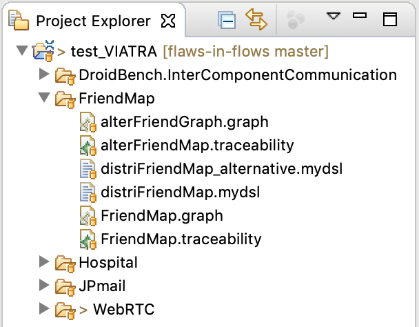

# Flaws-in-flows
Eclipse plug-in for a Security Analysis of SecDFDs

# Description
This code base is an Eclipse plug-in used for modeling and analyzing Security Data Flow Diagrams (SecDFDs) with the use of principles from information flow control. 
The objective of this automated analysis is to help identify design flaws in the form of violations of the intended security properties.
The plug-in is realized in the Eclipse Modeling Framework and Viatra Query Language (https://www.eclipse.org/viatra/documentation/query-language.html).
Modeling the SecDFDs is enhanced with a simple Domain Specific Language, developed with the Xtext framework (https://www.eclipse.org/Xtext/).
The main functionality enabled by this plug-in is the automatic propagation of security lables over a model instance of a SecDFD. The label propagation is implemented as part of a Model-to-Model (M2M) transformation, where an algorithm visits the model and applies the propagation rules accordingly.
A final static check of the global policy is realized with the Object Constraint Language (OCL).

# Requirements
1. Eclipse Framework (v Oxygen.3a Release (4.7.3a)
2. Eclipse Modeling Framework SDK (v 2.13.0)
3. OCL Classic SDK (v 5.3.0)
4. Xtext Complete SDK (v 2.12.0)
5. VIATRA Query and Transformation SDK (v 1.6.2)

# How to use the plug-in
In the following, we provide steps to execute an analysis of a set of case studies.
1. Import the source code of the plug-in into the Eclipse workspace.
2. Launch the plug-in in a seperate Eclipse runtime engine
3. Import the project located in the "runtime" folder
   This project includes subfolders with the models of the case studies: FriendMap, Hospital, JPmail, and WebRTC. The description of these cases can be found in the full version of the paper.
   
   

   
   

   
   Alternitevely, you can create a new project and model other systems using the DSL. After this, the analyst must create an empty model instance of a simple graph (.graph) and a traceability model (.traceability). The traceability model must contain the reference to the model instances of the simple graph and the SecDFD specified with the DSL.
4. You can view the model istances of individual cases by opening the files .mydsl
5. Run the model transformation by opening the .traceability file, right-clicking on the EDFD To Graph element and selecting either (a) Transform, or (b) TransformEndToEnd
6. The simple graph model instance is now pupulated with the relevant infromation for performing a static global policy check
7. Save the graph model and open it in the Eclipse workspace > Graph > model > .graph
8. The static check can be performed by right-clicking on the root element and selecting "Validate". 

